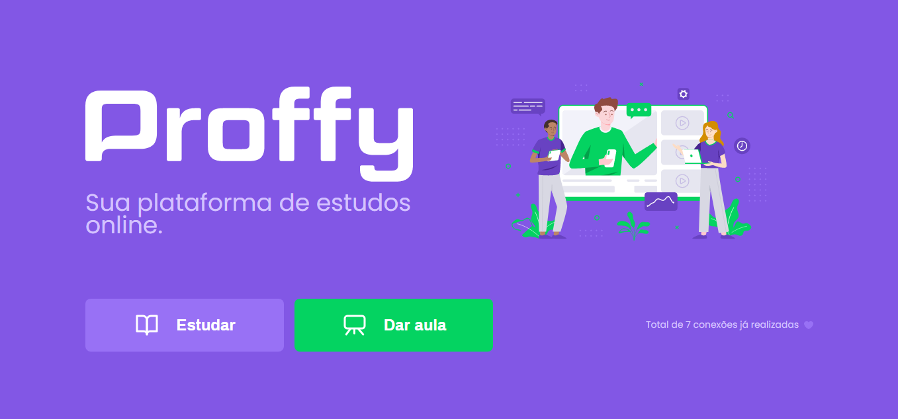
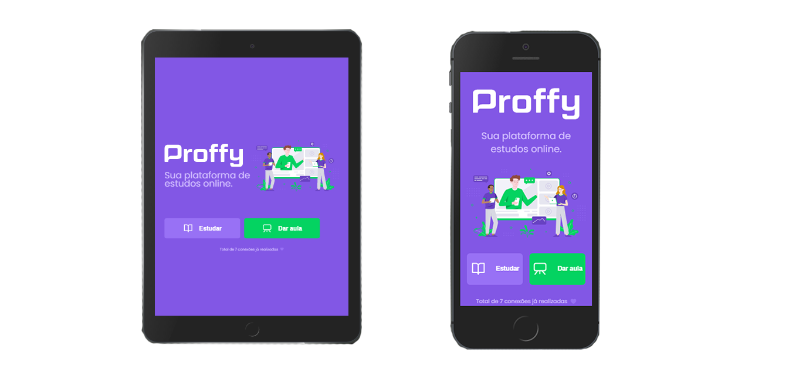
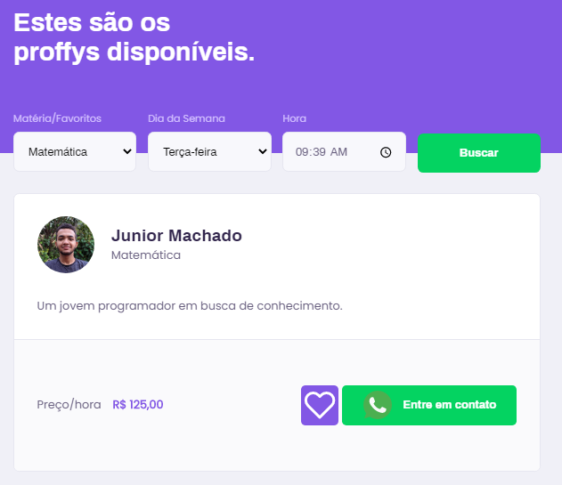

<h1 align="center">Proffy</h1>

Proffy é uma aplicação desenvolvida na Next Level Week. Disponibilizando uma plataforma onde é possível oferecer ou contratar o serviço de dar aula.

 
<h1 align="center"></h1>

<h2>Mobile first</h2>

Desenvolvido com mobile first, a aplicação possui responsividade para dispositivos móveis.

 
<h1 align="center"></h1>

<h2>Professores</h2>

Professores podem criar aulas, com dias, horários e matéria definidos. Que será exibido aos demais usuários que acessarem a página de listagem de aulas. Onde as aulas são filtradas por matéria, dia, e hora.

 
<h1 align="center"></h1>
 

Também é possível favoritar ou desfavoritar uma aula, salvando localmente as informações.

 
<h1 align="center"></h1>
